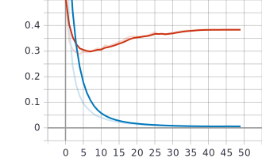
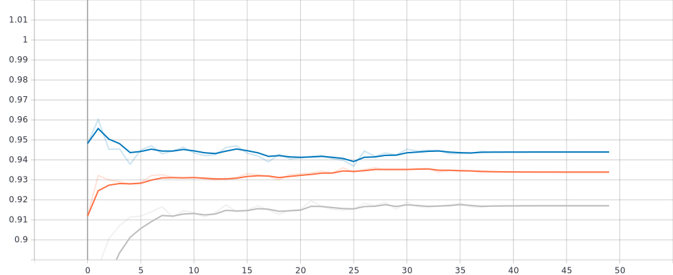

## Natural Language Understanding Using Bidirectional Encoder Representations from Transformers (BERT) ## 
    - Bert base uncased model from [1] was fine-tuned to learn 3 task jointly.
    - These three task includes:
        - Named-entity recognition
        - Scenario classifcation
        - Intent classifiction
    - Hugginface [2] was used for the to obtain pretrained bert model.

## How to do inference ##
    - Download the optimized model 
         - https://drive.google.com/file/d/1H8lDIH14TGsj_Jl11kvuFOuu9RvZ02FB/view?usp=sharing
    - Install the dependcies in the requirement.txt
    - python engine.py --model_file PATH_TO_MODEL
        - This will use flask to host a local server to serve the model at an the endponint **/test**
    - You can pass your sentence for inference like this:
        -  **http://127.0.0.1:5000/test?sentence=play song by eminem**
        - Get response back
    - You can look at the intent and scenario to formualte sentences that the model may have learnt
        - eg. wake me up at 5 am
        - eg. dim the lights
        - eg. play some rap song 
        - etc.
  

## Model Performance evaluation ## 

 - The model starts to overfitt the dataset at about 5th epoch.
 - Hence, early stopping performed and the best  model  found at the 6th epoch  is used for inference.

**Validation Accuracy** 

    - The model is able to achives over 90% accuracy in all entity, classfication task.
    - There is still room for improvement; hyperparameters like learning-rate, schduler's num_train_step, projecting bert logits to higher dimension before calssification are some suggestion.
    - Other validation metrics including percision,recall, F1 score has not be calculated, and is next in the task list. I have reserved a test-set to evaluate these metrics.

    - Orange: Scenario
    - Blue: Entity
    - Gery: Intent

